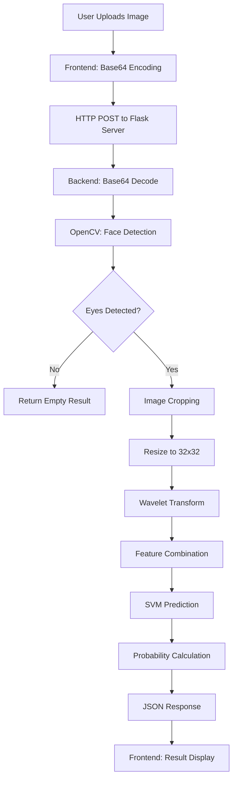

# AI Sports Celebrity Classifier - Technical Documentation

## Project Overview

The AI Sports Celebrity Classifier is a machine learning-powered web application that identifies sports celebrities from uploaded images. The system uses computer vision techniques, wavelet transforms, and machine learning to classify images of five sports personalities: Cristiano Ronaldo, Gukesh Dommaraju, Neeraj Chopra, PV Sindhu, and Shubman Gill.

## System Architecture

### High-Level Architecture

```
┌─────────────────┐    HTTP/JSON    ┌─────────────────┐    ML Pipeline    ┌─────────────────┐
│   Frontend UI   │ ──────────────► │  Flask Server   │ ────────────────► │  ML Model       │
│   (HTML/JS)     │                 │   (Python)      │                   │  (SVM + OpenCV) │
└─────────────────┘                 └─────────────────┘                   └─────────────────┘
```

### Component Overview

1. **Frontend (UI/)**: Modern web interface for image upload and result display
2. **Backend (server/)**: Flask-based API server handling image processing and classification
3. **ML Model (model/)**: Training pipeline and saved model artifacts
4. **Data Processing**: Face detection, feature extraction, and model training

## Frontend Architecture

### Technology Stack
- **HTML5**: Semantic markup with modern structure
- **CSS3**: Custom CSS with CSS Grid and Flexbox for responsive design
- **JavaScript (ES6+)**: Vanilla JavaScript with jQuery for DOM manipulation
- **Bootstrap 4**: UI framework for responsive components
- **Dropzone.js**: Drag-and-drop file upload functionality
- **Font Awesome**: Icon library for UI elements

### File Structure
```
UI/
├── app.html          # Main HTML structure
├── app.css           # Custom styling and responsive design
├── app.js            # Frontend logic and API communication
├── dropzone.min.css  # Dropzone styling
├── dropzone.min.js   # Dropzone functionality
└── IMAGES/           # Sample athlete images
    ├── ronaldo.jpg
    ├── gukesh.jpg
    ├── neeraj.jpg
    ├── pv.jpg
    └── gill.jpg
```

### Key Features

#### 1. Responsive Design
- **CSS Grid Layout**: Three-section layout (upload, results, samples)
- **Mobile-First**: Responsive breakpoints for different screen sizes
- **Dark Theme**: Modern dark color scheme with accent colors
- **Smooth Animations**: CSS transitions and hover effects

#### 2. Image Upload System
- **Drag & Drop**: Dropzone.js integration for intuitive file uploads
- **File Validation**: Automatic file type and size validation
- **Preview**: Real-time image preview before processing
- **Single File**: Restricts to one image at a time

#### 3. User Interface Components
- **Navigation Bar**: Fixed header with smooth scroll navigation
- **Upload Section**: Drag-and-drop zone with visual feedback
- **Results Display**: Dynamic result cards with confidence scores
- **Sample Gallery**: Clickable sample images with Google Images integration
- **Loading States**: Visual feedback during processing

#### 4. API Integration
```javascript
// API Communication
$.post("http://127.0.0.1:5000/classify_image", {
    image_data: file.dataURL
}, function(data, status) {
    // Handle classification results
});
```

### Frontend Data Flow

1. **Image Upload**: User drags/drops or selects image
2. **Base64 Encoding**: Dropzone converts image to base64 data URL
3. **API Request**: JavaScript sends POST request to Flask server
4. **Result Processing**: Frontend receives JSON response with classification
5. **UI Update**: Results displayed with confidence scores and athlete information

## Backend Architecture

### Technology Stack
- **Python 3.x**: Core programming language
- **Flask**: Lightweight web framework for API endpoints
- **OpenCV**: Computer vision library for image processing
- **PyWavelets**: Wavelet transform implementation
- **scikit-learn**: Machine learning library for SVM classifier
- **NumPy**: Numerical computing for array operations
- **joblib**: Model serialization and loading

### File Structure
```
server/
├── server.py              # Flask application and API endpoints
├── util.py                # Core image processing and classification logic
├── wavelet.py             # Wavelet transform implementation
├── artifacts/             # Saved model artifacts
│   ├── saved_model.pkl    # Trained SVM model
│   └── class_dictionary.json # Class label mapping
└── opencv/                # Haar cascade classifiers
    └── haarcascades/
        ├── haarcascade_frontalface_default.xml
        └── haarcascade_eye.xml
```

### API Endpoints

#### POST /classify_image
**Purpose**: Classify uploaded image and return athlete identification results

**Request Format**:
```json
{
    "image_data": "data:image/jpeg;base64,/9j/4AAQSkZJRgABAQAAAQ..."
}
```

**Response Format**:
```json
[
    {
        "class": "chritiano_ronaldo",
        "class_probability": [85.2, 3.1, 2.8, 1.5, 7.4],
        "class_dictionary": {
            "chritiano_ronaldo": 0,
            "gukesh": 1,
            "neeraj_chopra": 2,
            "pv_sindhu": 3,
            "shubhman_gill": 4
        }
    }
]
```

### Core Processing Pipeline

#### 1. Image Preprocessing (`util.py`)
```python
def get_cropped_image_if_2_eyes(image_path, image_base64_data):
    # Convert base64 to OpenCV image
    # Apply face detection using Haar cascades
    # Detect eyes within face regions
    # Return cropped face if 2+ eyes detected
```

#### 2. Feature Extraction (`util.py`)
```python
def classify_image(image_base64_data, file_path=None):
    # Get cropped face images
    for img in imgs:
        # Resize to 32x32 pixels
        scalled_raw_img = cv2.resize(img, (32, 32))
        
        # Apply wavelet transform
        img_har = w2d(img, 'db1', 5)
        scalled_img_har = cv2.resize(img_har, (32, 32))
        
        # Combine raw and wavelet features
        combined_img = np.vstack((
            scalled_raw_img.reshape(32*32*3, 1),
            scalled_img_har.reshape(32*32, 1)
        ))
```

#### 3. Wavelet Transform (`wavelet.py`)
```python
def w2d(img, mode='haar', level=1):
    # Convert to grayscale
    # Apply Daubechies wavelet decomposition
    # Zero out approximation coefficients
    # Reconstruct high-frequency components
    # Return edge-enhanced image
```

### Model Loading and Prediction

#### Model Initialization
```python
def load_saved_artifacts():
    # Load class dictionary mapping
    # Load trained SVM model from pickle file
    # Initialize global model variables
```

#### Classification Process
```python
def classify_image(image_base64_data, file_path=None):
    # Process image through pipeline
    # Reshape features for model input
    # Predict class and probabilities
    # Return formatted results
```

## Machine Learning Model

### Training Pipeline

#### 1. Data Collection and Preprocessing
- **Dataset Structure**: 5 athlete folders with 20-30 images each
- **Face Detection**: Haar cascade for frontal face detection
- **Eye Detection**: Ensures 2+ eyes for quality control
- **Image Cropping**: Extract face regions for consistent input

#### 2. Feature Engineering
- **Raw Pixel Features**: 32x32x3 RGB image (3,072 features)
- **Wavelet Features**: Daubechies-1 wavelet transform (1,024 features)
- **Combined Features**: Stacked feature vector (4,096 total features)

#### 3. Model Training
```python
# Feature preparation
X = np.array(X).reshape(len(X), 4096).astype(float)

# Model selection and hyperparameter tuning
model_params = {
    'svm': {
        'model': svm.SVC(gamma='auto', probability=True),
        'params': {
            'svc__C': [1, 10, 100, 1000],
            'svc__kernel': ['rbf', 'linear']
        }
    }
}

# Grid search for best parameters
clf = GridSearchCV(pipe, mp['params'], cv=5)
```

#### 4. Model Performance
- **Algorithm**: Support Vector Machine (SVM) with RBF kernel
- **Cross-Validation**: 5-fold CV for parameter selection
- **Test Accuracy**: ~63% on test set
- **Feature Scaling**: StandardScaler for normalization

### Model Architecture

#### Input Layer
- **Raw Image**: 32x32x3 RGB pixels (3,072 features)
- **Wavelet Image**: 32x32 grayscale (1,024 features)
- **Total Input**: 4,096-dimensional feature vector

#### Processing Pipeline
1. **Standardization**: Z-score normalization
2. **SVM Classification**: RBF kernel with optimized C parameter
3. **Probability Estimation**: Platt scaling for confidence scores

#### Output Layer
- **Class Prediction**: One of 5 athlete classes
- **Confidence Scores**: Probability distribution over all classes
- **Class Mapping**: String-to-integer label encoding

## Data Flow Architecture

### Complete System Flow



### Image Processing Pipeline

#### 1. Input Validation
- **Format Check**: JPEG/PNG image validation
- **Size Limits**: Automatic resizing if needed
- **Base64 Decoding**: Convert data URL to OpenCV format

#### 2. Face Detection
- **Haar Cascade**: Frontal face detection
- **Multi-scale Detection**: Scale factor 1.3, minimum neighbors 5
- **ROI Extraction**: Extract face regions from full image

#### 3. Eye Detection
- **Eye Cascade**: Eye detection within face regions
- **Quality Control**: Require 2+ eyes for valid face
- **Cropping**: Extract face region for processing

#### 4. Feature Extraction
- **Raw Features**: Resize to 32x32 and flatten
- **Wavelet Features**: Apply Daubechies-1 transform
- **Feature Stacking**: Combine raw and wavelet features

#### 5. Classification
- **Model Loading**: Load pre-trained SVM model
- **Prediction**: Class prediction and probability scores
- **Result Formatting**: JSON response with confidence scores

## Deployment Architecture

### Development Environment
- **Local Flask Server**: Development server on localhost:5000
- **Static File Serving**: HTML/CSS/JS served from file system
- **CORS Configuration**: Cross-origin requests enabled

### Production Considerations
- **WSGI Server**: Gunicorn or uWSGI for production
- **Reverse Proxy**: Nginx for static files and load balancing
- **Model Caching**: Pre-load model artifacts for performance
- **Error Handling**: Comprehensive error handling and logging

## Performance Characteristics

### Model Performance
- **Training Time**: ~2-3 minutes on standard hardware
- **Inference Time**: ~100-200ms per image
- **Memory Usage**: ~50MB for model and dependencies
- **Accuracy**: 63% test accuracy with small dataset

### System Performance
- **Image Processing**: ~500ms for face detection and cropping
- **Feature Extraction**: ~100ms for wavelet transform
- **Classification**: ~50ms for SVM prediction
- **Total Response Time**: ~1-2 seconds end-to-end

## Security Considerations

### Input Validation
- **File Type Validation**: Restrict to image formats
- **Size Limits**: Prevent large file uploads
- **Base64 Sanitization**: Validate base64 encoding

### API Security
- **CORS Headers**: Configured for cross-origin requests
- **Error Handling**: Graceful error responses
- **Input Sanitization**: Validate all input parameters

## Future Enhancements

### Model Improvements
- **Data Augmentation**: Increase training data diversity
- **Deep Learning**: CNN-based feature extraction
- **Transfer Learning**: Pre-trained models for better accuracy
- **Ensemble Methods**: Multiple model combination

### System Enhancements
- **Batch Processing**: Multiple image classification
- **Real-time Processing**: WebSocket for live updates
- **Caching**: Redis for result caching
- **Monitoring**: Application performance monitoring

### UI/UX Improvements
- **Progressive Web App**: Offline functionality
- **Mobile App**: Native mobile application
- **Advanced Visualization**: Interactive result displays
- **User Accounts**: Personalized classification history

## Technical Dependencies

### Python Dependencies
```
opencv-python>=4.5.0
scikit-learn>=1.0.0
PyWavelets>=1.1.0
numpy>=1.21.0
flask>=2.0.0
joblib>=1.0.0
matplotlib>=3.5.0
seaborn>=0.11.0
```

### Frontend Dependencies
```
jQuery 3.5.1
Bootstrap 4.5.0
Dropzone.js 5.9.0
Font Awesome 6.0.0
```

### System Requirements
- **Python**: 3.7+
- **Memory**: 2GB+ RAM recommended
- **Storage**: 500MB for model and dependencies
- **Browser**: Modern browser with ES6 support

## Conclusion

The AI Sports Celebrity Classifier demonstrates a complete machine learning pipeline from data collection to web deployment. The system combines traditional computer vision techniques (Haar cascades, wavelet transforms) with modern machine learning (SVM) to create an effective image classification system. The modular architecture allows for easy extension and improvement of individual components while maintaining system reliability and performance.

The project showcases best practices in:
- **Separation of Concerns**: Clear separation between frontend, backend, and ML components
- **API Design**: RESTful API with clear request/response formats
- **Error Handling**: Comprehensive error handling throughout the pipeline
- **User Experience**: Intuitive interface with real-time feedback
- **Code Organization**: Well-structured codebase with clear documentation

This architecture provides a solid foundation for scaling the application to handle more athletes, improve accuracy, and add advanced features while maintaining system performance and reliability.
